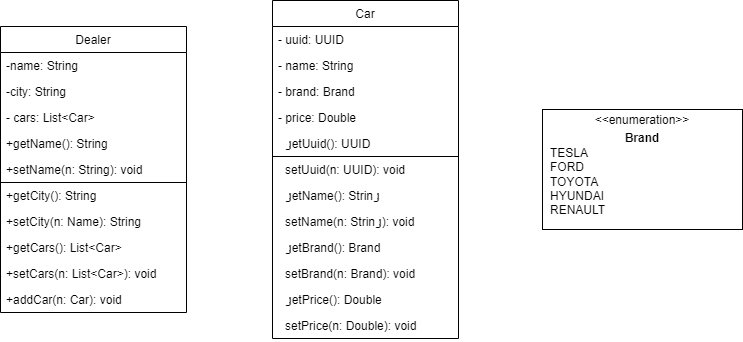

# Car dealer

We want to create a list of car dealer shops.

## Exercise
- Create the Dealer class.
- Look at the Brand class. Why would you choose an Enum (https://www.w3schools.com/java/java_enums.asp) here?
- Implement the methods in the CarDealerServiceImpl.
  - Use the carService to retrieve data about cars.

## Services
We have a CarService that is responsible for the saving and retrieving of car data. 
The CarDealerService is responsible for the saving and retrieving of the Dealer information.  
